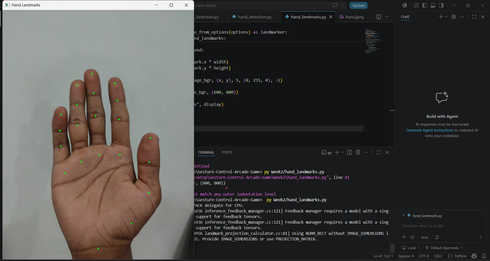
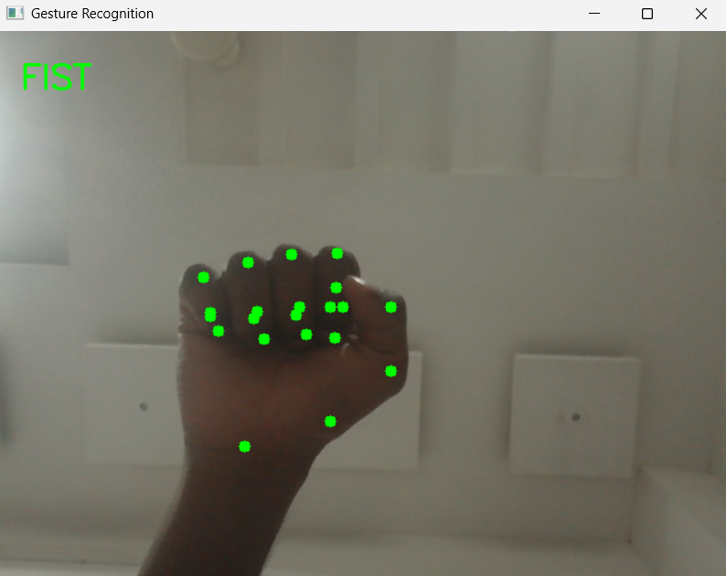
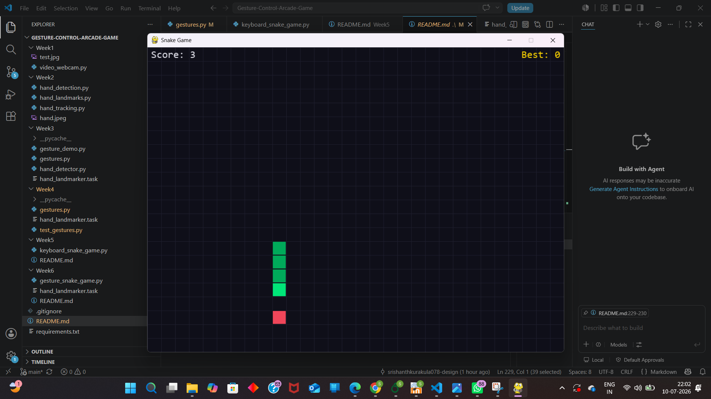
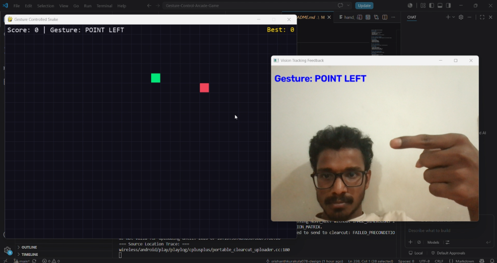

# 🎮 Gesture Controlled Arcade Game
### WnCC Seasons of Code (SoC) 2026 | IIT Bombay

---

# 📖 Project Overview

Gesture Controlled Arcade Game is a six-week Computer Vision project completed as part of **Seasons of Code (SoC) 2026** conducted by the **Web and Coding Club (WnCC), IIT Bombay**.

The project explores how computer vision can replace traditional keyboard-based interaction with natural hand gestures. Using **OpenCV** and **MediaPipe**, the system detects and recognizes hand gestures in real time through a webcam and converts them into movement commands for a Snake game developed using **Pygame**.

The project progresses gradually from learning image processing fundamentals to building a complete gesture-controlled arcade game.

---

# 🎯 Problem Statement

Most computer games rely on physical devices such as keyboards or controllers for interaction. The objective of this project is to create a touch-free gaming experience by using Computer Vision techniques to recognize hand gestures and use them as game controls.

The final application allows the user to play the classic Snake Game entirely using hand gestures captured through a webcam.

---

# 🎯 Objectives

- Learn the fundamentals of Computer Vision.
- Understand image processing using OpenCV.
- Perform real-time hand landmark detection using MediaPipe.
- Recognize different hand gestures.
- Build a modular gesture recognition pipeline.
- Integrate gesture recognition with a Snake game.
- Create a complete gesture-controlled interactive application.

---

# 🚀 Features

- 📹 Real-time webcam processing
- ✋ Hand landmark detection
- 🖐 Gesture recognition
- 🎮 Gesture-controlled Snake Game
- 🐍 Keyboard-controlled Snake Game
- 📈 Live score tracking
- 🔄 Restart functionality
- 🧩 Modular project structure
- ⚡ Real-time interaction

---

# 🛠 Technologies Used

| Technology | Purpose |
|------------|---------|
| Python | Programming Language |
| OpenCV | Image Processing |
| MediaPipe | Hand Landmark Detection |
| Pygame | Snake Game Development |
| NumPy | Numerical Computations |

---

# 📂 Repository Structure

```
Gesture-Controlled-Arcade-Game
│
├── Assets
│
├── Week1
├── Week2
├── Week3
├── Week4
├── Week5
├── Week6
│
├── README.md
├── requirements.txt
└── .gitignore
```

---

# 📅 Weekly Progress

## ✅ Week 1 – Python & OpenCV Basics

During the first week, the development environment was configured and the basic concepts required for Computer Vision were explored.

### Tasks Completed

- Installed Python and required libraries
- Set up OpenCV
- Learned image loading and display
- Captured webcam frames
- Drew shapes and text
- Worked with image resizing and basic processing

---

## ✅ Week 2 – Introduction to MediaPipe

This week introduced Google's MediaPipe framework for real-time hand tracking.

### Tasks Completed

- Installed MediaPipe
- Configured Hand Landmarker
- Detected hands from webcam
- Visualized 21 hand landmarks
- Understood landmark indexing

---

## ✅ Week 3 – Gesture Detection

The focus shifted from detecting hands to identifying gestures.

### Tasks Completed

- Extracted landmark coordinates
- Calculated finger positions
- Implemented gesture detection logic
- Identified different finger configurations
- Tested gestures using live webcam input

---

## ✅ Week 4 – Gesture Recognition Module

A reusable gesture recognition module was created.

### Tasks Completed

- Organized gesture detection into functions
- Improved gesture stability
- Tested multiple gestures
- Verified gesture recognition using webcam

---

## ✅ Week 5 – Keyboard Controlled Snake Game

The keyboard-controlled Snake game was explored to understand how the game operates before integrating gesture control.

### Tasks Completed

- Ran the keyboard version of the Snake game
- Understood the game loop
- Studied snake movement logic
- Learned food generation
- Studied collision detection
- Understood score management
- Analyzed keyboard-based controls

---

## ✅ Week 6 – Gesture Controlled Snake Game

The final stage integrated the gesture recognition pipeline with the Snake game.

The keyboard controls were replaced with real-time gesture commands obtained from MediaPipe.

### Tasks Completed

- Integrated gesture recognition with Snake Game
- Connected webcam input with game controls
- Controlled snake using gestures
- Tested complete application
- Verified real-time gameplay

---

# ⚙️ System Workflow

```
               Webcam
                  │
                  ▼
       OpenCV Video Capture
                  │
                  ▼
    MediaPipe Hand Detection
                  │
                  ▼
      Hand Landmark Extraction
                  │
                  ▼
      Gesture Recognition Logic
                  │
                  ▼
     Movement Command Generation
                  │
                  ▼
        Pygame Snake Game
                  │
                  ▼
        Real-Time Gameplay
```

---

# ▶ Installation

Clone the repository

```bash
git clone <repository-url>
```

Move into the project directory

```bash
cd Gesture-Controlled-Arcade-Game
```

Install dependencies

```bash
pip install pygame opencv-python mediapipe numpy
```

---

# ▶ Running the Project

## Keyboard Controlled Snake Game

```bash
cd Week5
python keyboard_snake_game.py
```

---

## Gesture Controlled Snake Game

```bash
cd Week6
python gesture_snake_game.py
```

---

# 🎮 How to Play

## Keyboard Version

- Launch the keyboard Snake game.
- Press **Space** to start.
- Use the Arrow Keys to move.
- Eat food to increase your score.
- Avoid colliding with walls or yourself.

---

## Gesture Version

- Launch the gesture-controlled Snake game.
- Ensure the webcam detects your hand.
- Make a **Fist** to start/restart.
- Use pointing gestures to move the snake.
- Eat food to increase your score.
- Avoid collisions.
- Restart after Game Over using the **Fist** gesture.

---

# 🖐 Gesture Mapping

| Gesture | Action |
|----------|--------|
| 👊 Fist | Start / Restart |
| ☝️ Point Up | Move Up |
| 👇 Point Down | Move Down |
| 👈 Point Left | Move Left |
| 👉 Point Right | Move Right |
| ✋ Open Palm | Pause *(if supported)* |

---

# 📸 Screenshots

## Week 2 – Hand Landmark Detection



---

## Week 4 – Gesture Recognition



---

## Week 5 – Keyboard Snake Game



---

## Week 6 – Gesture Controlled Snake Game



---

# 📚 Learning Outcomes

Through this project I learned:

- Python programming
- Computer Vision fundamentals
- Image processing using OpenCV
- Real-time webcam applications
- MediaPipe Hand Tracking
- Hand Landmark Detection
- Gesture Recognition
- Pygame fundamentals
- Integrating Computer Vision with interactive applications
- Organizing and managing projects using Git and GitHub

---

# 🔮 Future Improvements

Possible extensions include:

- Multiple arcade games using gestures
- Custom gesture mapping
- Dynamic difficulty levels
- Multiplayer mode
- Voice command integration
- AI-based gesture recognition
- Support for additional hand gestures

---

# 👨‍💻 Author

**Srishanth K**

Electrical Engineering Department

Indian Institute of Technology Bombay

Completed as part of **Web and Coding Club (WnCC) – Seasons of Code 2026**
cd Week4
python test_gestures.py
